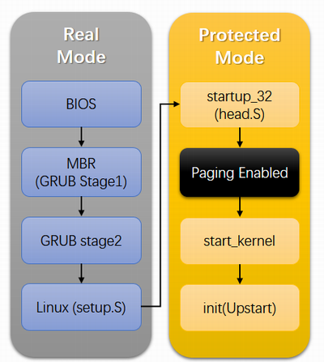
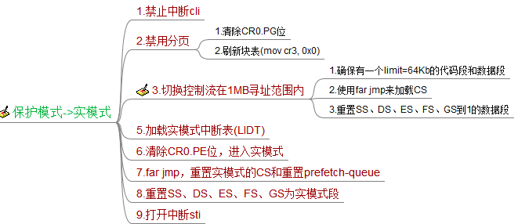

# 解读Linux启动过程

> 2017-08-31, beijing, @elemeta
 
## 1. 概述

本文解读一下从CPU加电自检到启动init进程的过程, 先通过下面这张图大致看一下Linux启动的整个过程。

 
本文的分析环境是GRUB 0.97 + Linux 2.6.18。

## 2. BIOS

CPU加电后首先工作在实模式并初始化CS:IP=FFFF:FFF0，BIOS的入口代码必须从该地址开始。BIOS完成相应的硬件检查并提供一系列中断服务例程，这些中断服务提供给系统软件访问硬件资源(比如磁盘、显示器等)，最后选择一个启动盘加载第一个扇区(即：MBR，共512字节)数据到内存0x7C00处，并从这里开始执行指令(CS:IP=0000:7C00)，对于笔者的电脑来说这就是GRUB的Stage1部分。

## 3. GRUB

GRUB的作用是bootloader，用来引导各种OS的。

### 3.1. Stage1

Stage1就是MBR，由BIOS把它从磁盘的0扇区加载到0x7c00处，大小固定位512字节，此时的CPU上下文如下：

    eax=0011aa55 ebx=00000080 ecx=00000000 edx=00000080 esi=0000f4a0 edi=0000fff0
    eip=00007c00 esp=00007800 ebp=00000000 iopl=0 nv up ei pl zr na po nc
    cs=0000 ds=0000 es=0000 fs=0000 gs=0000 ss=0000 eflags=00000246
    // 注: dl=启动磁盘号, 00H~7FH是软盘, 80H~FFH是硬盘。

因为只能是512字节，大小受限，它就干一件事，把Stage2的第一个512字节读取到0x8000，然后jmp到0x8000继续执行。

### 3.1.1. 读磁盘

磁盘扇区寻址有两种方式：

- CHS方式：传统的方式，使用三元组(10位Cylinder, 8位Head, 6位Sector)来寻找扇区，最大只能找到`(2^10) * (2^8) * (2^6) * 512 = 8GB`的硬盘容量，现在的硬盘明显不够用了。
- LBA方式：现在的方式，使用48位线性地址来寻找扇区，最大支持`(2^48) * 512 = 128PB`的硬盘空间。虽然机械上还是CHS的结构，不过磁盘的固件会自动完成LBA到CHS的转换。

因为CHS明显不适合现在的硬盘，所以LBA模式寻址是现在的PC的标配了吧！万一磁盘不支持LBA或者是软盘，需要我们手工转换成CHS模式。转换公式如下(就是三维空间定位一个点的问题)：

    磁道号C = LBA / 每磁道的扇区数SPT / 盘面总HPC
    磁头号H = (LBA / 每磁道的扇区数SPT) mod HPC
    扇区号S = (LBA mod SPT) + 1

判断是否支持LBA模式

    /* check if LBA is supported */
    movb	$0x41, %ah
    movw	$0x55aa, %bx
    int	$0x13

如果返回成功(CF=1)并且BX值是0xAA55表示支持LBA寻址(用Extensions方法)。

**注意：3.5英寸软盘需要使用CHS方式寻址，它的CHS参数是80个柱面、2个磁头、每个磁道18个扇区，每扇区512字节，共1.44MB容量。**

LBA模式读的功能号是AH=42h，DL参数是磁盘号，DS:SI参数是Disk Address Packet(DAP)结构体的内存地址，定义如下：

    struct DAP {
        uint8_t sz; // 结构体大小
        uint8_t unused;
        uint16_t sector_cnt; // 需要都的扇区总数
        struct dst_addr { // 内存地址，读到这里
            uint16_t offset;
            uint16_t segment;
        };
        uint64_t lba_addr;  // 磁盘的LBA地址
    };

参考：

- https://en.wikipedia.org/wiki/Logical_block_addressing#CHS_conversion
- https://en.wikipedia.org/wiki/INT_13H

### 3.2. Stage2
Stage2就是GRUB剩下的全部的代码了，包括BIOS中断服务的封装给C代码使用、键盘驱动、文件系统驱动、串口、网络驱动等等，它提供了一个小型的命令行环境，可以解析用户输入命令并执行对OS的启动。

#### 3.2.1. start.S

首先Stage2的头512字节(start.S)被加载到0x8000，并在这里开始执行，此时的CPU上下文如下：

    eax=00000000 ebx=00007000 ecx=00646165 edx=00000080 esi=00007c05 edi=0000fff0
    eip=00008000 esp=00001ffe ebp=00000000 iopl=0 nv up ei pl zr na po nc
    cs=0000 ds=0000 es=0800 fs=0000 gs=0000 ss=0000 eflags=00000246

start.S的工作是把Stage2的后续部分全部加载到内存中(从0x8200开始)，有103KB大小。

#### 3.2.2. asm.S

asm.S是0x8200处的代码，先看一下CPU上下文环境：

    eax=00000e00 ebx=00000001 ecx=00646165 edx=00000080 esi=00008116 edi=000081e8
    eip=00008200 esp=00001ffe ebp=000062d8 iopl=0 nv up ei pl zr na po nc
    cs=0000 ds=0000 es=1ae0 fs=0000 gs=0000 ss=0000 eflags=00000246

##### 3.2.2.1. 最开始的代码应该设置好段寄存器和栈

    cli
    /* set up %ds, %ss, and %es */
    /* cs=0000 ds=0000 es=0000 fs=0000 gs=0000 ss=0000 */
    xorw	%ax, %ax
    movw	%ax, %ds
    movw	%ax, %ss
    movw	%ax, %es

    /* set up the real mode/BIOS stack */
    movl	$STACKOFF, %ebp
    movl	%ebp, %esp
    sti

此时：

    cs=0000 ds=0000 es=0000 ss=0000 esp=00001ff0 ebp=00001ff0。

##### 3.2.2.2. 保护模式和实模式

因为GRUB没有实现自己的中断服务，所以访问硬件资源还是使用BIOS的中断服务例程(实模式)。GRUB的命令行环境是工作在保护模式下的，所以当GRUB需要访问BIOS中断的时候需要切换回实模式，于是在GRUB执行过程中会有频繁的实模式和保护模式的互相切换操作，**当切换回实模式后别忘了保存保护模式下的栈指针**。

（1） 实模式进入保护模式

    /* transition to protected mode */
    DATA32	call EXT_C(real_to_prot)

    /* The ".code32" directive takes GAS out of 16-bit mode. */
    .code32

下图是实模式到保护模式的切换步骤:

 
GRUB没有设置分页机制和新的中断，所以GRUB的保护模式访问的是物理内存且是不能使用INT指令,不过对于bootloader来说够用了。因为需要切换到保护模式栈，原来的返回地址要放到新的栈上，以保证能够正常ret：

	ENTRY(real_to_prot)
		...
		/* put the return address in a known safe location */
		movl	(%esp), %eax
		movl	%eax, STACKOFF  ; 把返回地址保存起来备用

		/* get protected mode stack */
		movl	protstack, %eax
		movl	%eax, %esp
		movl	%eax, %ebp      ; 设置保护模式的栈

		/* get return address onto the right stack */
		movl	STACKOFF, %eax
		movl	%eax, (%esp)    ; 把返回地址重新放到栈上
		
		/* zero %eax */
		xorl	%eax, %eax

		/* return on the old (or initialized) stack! */
		ret                     ; 正常返回

(2)	保护模式切换回实模式

		/* enter real mode */
		call	EXT_C(prot_to_real)
		
		.code16

下图说明了保护模式切换回实模式的步骤：
 

保护模式的栈需要保存起来以便恢复现场，让C代码正确运行，实模式的栈每次都重置为STACKOFF即可，和(1)一样，也要设置好返回地址:

	ENTRY(prot_to_real)
		...
		/* save the protected mode stack */
		movl	%esp, %eax
		movl	%eax, protstack  ; 把栈保存起来

		/* get the return address */
		movl	(%esp), %eax
		movl	%eax, STACKOFF   ; 返回地址放到实模式栈里

		/* set up new stack */
		movl	$STACKOFF, %eax  ; 设置实模式的栈
		movl	%eax, %esp
		movl	%eax, %ebp
		... 

##### 3.2.2.3. 创建C运行时环境

C的运行环境主要包括栈、bss数据区、代码区。随着切换到保护模式，栈已经设置好了；随着Stage2从磁盘加载到内存，代码区和bss区都已经在内存了，最后还需要把bss区给初始化一下(清0)，接下来即可愉快的执行C代码了。

##### 3.2.2.4. 启用A20

启用A20地址线后才可以访问1MB以上的内存，否则无法正常加载内核代码到内存的。代码在asm.S的gateA20例程中。这里先跳过，后面Linux的setup.S的时候再详细解读如何开启A20。

##### 3.2.2.5. 执行cmain()

先执行一个`init_bios_info()`获取BIOS的信息，比如被BIOS使用的内存空间(影响我们Linux映像加载的位置)、磁盘信息、ROM信息、APM信息，最后调用cmain()。
cmain()函数在stage2.c文件中，其中最主要的函数`run_menu()`是启动一个死循环来提供命令行解析执行环境。

##### 3.2.2.6. load_image()

如果grub.cfg或者用户执行kenrel命令，会调用load_image()函数来将内核加载到内存中。**至于如何加载linux镜像在Documentation的boot.txt和zero-page.txt有详细说明。**

`load_image()`是一个非常长的函数，它要处理支持的各种内核镜像格式。Linux镜像vmlinuz文件头是`struct linux_kernel_header`结构体，该结构体里头说明了这个镜像使用的boot协议版本、实模式大小、加载标记位和需要GRUB填写的一些参数(比如:内核启动参数地址)。

- 实模式部分：始终被加载到0x90000位置，并从0x90200开始执行(linux 0.11就这样做了)。
- 保护模式部分：我们现在使用的内核比较大(大于512KB)，叫做bzImage，加载到0x100000(高位地址，1MB)开始的位置，可以任意大小了。否则小内核zImage放在0x10000到`mbi.mem_lower * 1024`(一般是0x90000)区域。

##### 3.2.2.7. linux_boot()

我们正常的启动过程调用的是`big_linux_boot()`函数，把实模式部分copy到0x90000后，设置其他段寄存器值位0x9000, 设置CS:IP=9020:0000开始执行(使用far jmp)。

**至此GRUB的工作完成，接下来执行权交给Linux了。**

## 4. setup.S

该文件在arch/i386/boot/setup.S，主要作用是收集硬件信息并进入保护模式head.S。初始的CPU上下文如下：

	eax=00000000 ebx=00009000 ecx=00000000 edx=00000003 esi=002d8b54 edi=0009a000
	eip=00000000 esp=00009000 ebp=00001ff0 iopl=0 nv up di pl zr na po nc
	cs=9020 ds=9000 es=9000 fs=9000 gs=9000 ss=9000  eflags=00000046

### 4.1. 自身检查

先检查自己setup.S是否合法，主要是检查末尾的两个magic是否一致

	# Setup signature -- must be last
	setup_sig1:	.word	SIG1
	setup_sig2:	.word	SIG2

### 4.2. 收集硬件信息

主要是通过BIOS中断来收集硬件信息。收集的信息包括内存大小、键盘、鼠标、显卡、硬盘、APM等等。收集的硬件信息保存在0x9000处：

    # 设置ds = 0x9000，用来保存硬件信息
	movw	%cs, %ax			# aka SETUPSEG
	subw	$DELTA_INITSEG, %ax 		# aka INITSEG
	movw	%ax, %ds

这里看一下如何获取内存大小，这样OS才能进行内存管理。这里用三种方法获取内存信息：

1. e820h：请求中断INT 15H，AX=E820H时返回可用的物理内存信息，e820由此得名，参考http://www.uruk.org/orig-grub/mem64mb.html。由于内存的使用是不连续的，通过连续调用INT 15H得到所有可用的内存区域,每次查询得到的结果ES:DI是个struct address_range_descriptor结构体，返回的结果都是64位的，完全能够满足目前PC的需求了。

		struct address_range_descriptor {
			uint32_t base_addr_low;   // 起始物理地址
			uint32_t base_addr_high;
			uint32_t length_low;      // 长度
			uint32_t length_high;
			uint8_t type;             // 1=OS可用的, 2=保留的，OS不可用
		};

2. e801h：通过请求中断INT15h,AX=e801H返回结果，最高只能得到4GB内存结果。
3. 88h：古老的办法，通过请求中断INT15h,AH=88H返回结果。最高只能得到16MB或者64MB的内存，现在的电脑不适用了。

扩展阅读：http://wiki.osdev.org/Detecting_Memory_(x86)#E820h

### 4.3. 启用A20

让CPU访问1MB以上的扩展内存,否则访问的是X mod 1MB的地址。下面列举三种开启A20的方法：

1. 使用I/0端口92H，AL的将1-bit置1

		inb	$0x92, %al			# Configuration Port A
		orb	$0x02, %al			# "fast A20" version
		andb	$0xFE, %al			# don't accidentally reset
		outb	%al, $0x92

2. 使用BIOS中断INT 0x15, AX=0x2401

		movw	$0x2401, %ax
		pushfl					# Be paranoid about flags
		int	$0x15
		popfl

3. 使用键盘控制器

		movb	 $0xD1, %al			# command write
		outb	 %al, $0x64
		call	 empty_8042

		movb	 $0xDF, %al			# A20 on
		outb	 %al, $0x60
		call	 empty_8042

### 4.4. 进入保护模式

#### 4.4.1. 临时的GDT和IDT

这里的IDT全部是0；Linux目前使用的GDT如下：

	gdt:
		.fill GDT_ENTRY_BOOT_CS,8,0

		.word	0xFFFF				# 4Gb - (0x100000*0x1000 = 4Gb)
		.word	0				# base address = 0
		.word	0x9A00				# code read/exec
		.word	0x00CF				# granularity = 4096, 386
							#  (+5th nibble of limit)

		.word	0xFFFF				# 4Gb - (0x100000*0x1000 = 4Gb)
		.word	0				# base address = 0
		.word	0x9200				# data read/write
		.word	0x00CF				# granularity = 4096, 386
							#  (+5th nibble of limit)
	gdt_end:

这里只定义了两个DPL为0的代码段和数据段，只给内核使用的。

#### 4.4.2. 设置CR0.PE

这里使用lmsw指令，它和mov cr0, X是等价的

	movw	$1, %ax				# protected mode (PE) bit
	lmsw	%ax				# This is it!
	jmp	flush_instr

### 4.5. 调转到head.S(CS:EIP=0x10:100000)

至此硬件信息就收集完成，这些收集到的硬件信息都保存在0x90000处，后续OS可以使用这些硬件信息来管理了。

## 5. head.S

该文件位于arch/i386/kernel/head.S，这个是内核保护模式的代码的起点，笔者电脑的位置在0x100000，此时CPU上下文是：

	eax=00000001 ebx=00000000 ecx=0000ff03 edx=47530081 esi=00090000 edi=00090000
	eip=00100000 esp=00008ffe ebp=00001ff0 iopl=0 nv up di pl nz na pe nc
	cs=0010 ds=0018 es=0018 fs=0018 gs=0018 ss=0018               eflags=00000002

**注：已经进入保护模式，CS的值是GDT表项的索引。**

它的作用就是设置真正的分段机制和分页机制、启动多处理器、设置C运行环境，最后执行`start_kernel()`函数。

### 5.1. startup_32

#### 5.1.1. 加载临时的分段机制

`boot_gdt_table`就是临时的GDT，其实和start.S的一样：

		lgdt boot_gdt_descr - __PAGE_OFFSET
		movl $(__BOOT_DS),%eax
		movl %eax,%ds
		movl %eax,%es
		movl %eax,%fs
		movl %eax,%gs

	ENTRY(boot_gdt_table)
		.fill GDT_ENTRY_BOOT_CS,8,0
		.quad 0x00cf9a000000ffff	/* kernel 4GB code at 0x00000000 */
		.quad 0x00cf92000000ffff	/* kernel 4GB data at 0x00000000 */

#### 5.1.2. 初始化内核bss区和内核启动参数

为了让C代码正常运行，bss区全部清0，启动参数需要移动到`boot_params`位置。

#### 5.1.3. 启动临时分页机制

临时的页表，只要能够满足内核使用就行。页目录表是`swapper_pg_dir`，它是一个4096大小的内存区域，默认全是0。一般`__PAGE_OFFSET=0xC0000000(3GB)`，这是要把物理地址0x00000000映射到0xc0000000的地址空间(内核地址空间)。下面是页目录表和页表的初始化代码：

	page_pde_offset = (__PAGE_OFFSET >> 20); // 3072,页目录的偏移

		// 页目录表存放在pg0位置，arch/i386/kernel/vmlinux.lds中定义
		movl $(pg0 - __PAGE_OFFSET), %edi
		movl $(swapper_pg_dir - __PAGE_OFFSET), %edx  // edx是页目录表的地址
		movl $0x007, %eax			/* 0x007 = PRESENT+RW+USER */
	10:
		// 创建一个页目录项
		leal 0x007(%edi),%ecx			/* Create PDE entry */
		movl %ecx,(%edx)			/* Store identity PDE entry */
		movl %ecx,page_pde_offset(%edx)		/* Store kernel PDE entry */
		addl $4,%edx   // 指向swapper_pg_dir的下一个项
		movl $1024, %ecx   // 每个页表1024个项目
	11:
		stosl  // eax -> [edi]; edi = edi + 4
		addl $0x1000,%eax // 每次循环，下一个页目录项
		loop 11b
		/* End condition: we must map up to and including INIT_MAP_BEYOND_END */
		/* bytes beyond the end of our own page tables; the +0x007 is the attribute bits */
		leal (INIT_MAP_BEYOND_END+0x007)(%edi),%ebp  // 页表覆盖到这里就终止
		cmpl %ebp,%eax
		jb 10b
		movl %edi,(init_pg_tables_end - __PAGE_OFFSET)

下面是对上面代码的翻译(这样更有利于理解)：

	extern uint32_t *pg0;  // 初始值全0
	extern uint32_t *swapper_pg_dir;  // 初始值全0

	void init_page_tables()
	{
		uint32_t PAGE_FLAGS = 0x007; // PRESENT+RW+USER
		uint32_t page_pde_offset = (_PAGE_OFFSET >> 20); // 3072
		uint32_t addr = 0 | PAGE_FLAGS;  // 内存地址+页表属性
		uint32_t *pg_dir_ptr = swapper_pg_dir; // 页目录表项指针
		uint32_t *pg0_ptr = pg0;  // 页表项指针
		
		for (;;) {
			// 设置页目录项，同时映射两个地址，让物理地址和虚拟地址都能访问，
			*pg_dir_ptr = pg0 | PAGE_FLAGS;     // 0, 1
			*(uint32_t *)((char *)pg_dir_ptr + page_pde_offset) = pg0 | PAGE_FLAGS;  // 768, 769
			pg_dir_ptr++;
			
			// 设置页表项目
			for (int i = 0; i < 1024; i++) {
				*pg0++ = addr;
				addr += 0x1024;
			}
			// 退出条件，实际上只映射了两个页目录就退出了(0,1,768, 769)
			if (pg0[INIT_MAP_BEYOND_END] | PAGE_FLAGS) >= addr) {
				init_pg_tables_end = pg0_ptr;
				return;
			}
		}	
	};

#### 5.1.4. 设置栈

	/* Set up the stack pointer */
		lss stack_start,%esp

	ENTRY(stack_start)
		.long init_thread_union+THREAD_SIZE
		.long __BOOT_DS

	/* arch/i386/kernel/init_task.c
	* Initial thread structure.
	*
	* We need to make sure that this is THREAD_SIZE aligned due to the
	* way process stacks are handled. This is done by having a special
	* "init_task" linker map entry..
	*/
	union thread_union init_thread_union 
		__attribute__((__section__(".data.init_task"))) =
			{ INIT_THREAD_INFO(init_task) };

内核最初使用的栈是`init_task`进程的，也就是0号进程的栈，这个进程是系统唯一一个静态定义而不是通过`fork()`产生的进程。

#### 5.1.5. 设置真正的IDT和GDT

		lgdt cpu_gdt_descr   // 真正的GDT
		lidt idt_descr    //真正的IDT
		ljmp $(__KERNEL_CS),$1f   // 重置CS
	1:	movl $(__KERNEL_DS),%eax	# reload all the segment registers
		movl %eax,%ss			# after changing gdt.  // 重置SS

		movl $(__USER_DS),%eax		# DS/ES contains default USER segment
		movl %eax,%ds
		movl %eax,%es

		xorl %eax,%eax			# Clear FS/GS and LDT
		movl %eax,%fs
		movl %eax,%gs
		lldt %ax
		cld			# gcc2 wants the direction flag cleared at all times
		// push一个假的返回地址以满足 start_kernel()函数return的要求
		pushl %eax		# fake return address  

对于IDT先全部初始化成`ignore_int`例程：

	setup_idt:
		lea ignore_int,%edx
		movl $(__KERNEL_CS << 16),%eax
		movw %dx,%ax		/* selector = 0x0010 = cs */
		movw $0x8E00,%dx	/* interrupt gate - dpl=0, present */

		lea idt_table,%edi
		mov $256,%ecx
	rp_sidt:
		movl %eax,(%edi)
		movl %edx,4(%edi)
		addl $8,%edi
		dec %ecx
		jne rp_sidt
		ret

`ignore_int`例程就干一件事，打印一个错误信息`"Unknown interrupt or fault at EIP %p %p %p\n"`。

对于GDT我们最关心的`__KERNEL_CS、__KERNEL_DS、__USER_CS、__USER_DS`这4个段描述符：

	.quad 0x00cf9a000000ffff	/* 0x60 kernel 4GB code at 0x00000000 */
	.quad 0x00cf92000000ffff	/* 0x68 kernel 4GB data at 0x00000000 */
	.quad 0x00cffa000000ffff	/* 0x73 user 4GB code at 0x00000000 */
	.quad 0x00cff2000000ffff	/* 0x7b user 4GB data at 0x00000000 */

至此分段机制、分页机制、栈都设置好了，接下去可以开心的`jmp start_kernel`了。

## 6. start_kernel

该函数在linux/init/main.c文件里。我们可以认为`start_kernel`是0号进程`init_task`的入口函数，0号进程代表整个linux内核且每个CPU有一个。
这个函数开始做一系列的内核功能初始化，我们重点看`rest_init()`函数。

### 6.1.rest_init
这是`start_kernel`的最后一行，它启动一个内核线程运行init函数后就什么事情也不做了(死循环，始终交出CPU使用权)。

	static void noinline rest_init(void)
	{
		kernel_thread(init, NULL, CLONE_FS | CLONE_SIGHAND); // 启动init
		……
		/* Call into cpu_idle with preempt disabled */
		cpu_idle();  // 0号进程什么事也不做
	}

### 6.2. init()
该函数的末尾fork了”/bin/init”进程。这样1号进程init就启动了，接下去就交给init进程去做应用层该做的事情了！

	// 以下进程启动后父进程都是0号进程
	if (ramdisk_execute_command) {
		run_init_process(ramdisk_execute_command);
		printk(KERN_WARNING "Failed to execute %s\n",
				ramdisk_execute_command);
	}

	/*
	 * We try each of these until one succeeds.
	 *
	 * The Bourne shell can be used instead of init if we are 
	 * trying to recover a really broken machine.
	 */
	if (execute_command) {
		run_init_process(execute_command);
		printk(KERN_WARNING "Failed to execute %s.  Attempting "
					"defaults...\n", execute_command);
	}
	run_init_process("/sbin/init");
	run_init_process("/etc/init");
	run_init_process("/bin/init");
	run_init_process("/bin/sh");

## 附录1. 启动多核CPU

以上解读的内容只在0号CPU上执行，如果是多CPU的环境，还要初始化其他的CPU。多CPU启动的起点是`start_kernel()`->`rest_init()`-`>init()`->`smp_init()`。而`smp_init()`函数给每个CPU上调用`cpu_up()`和`do_boot_cpu()`函数，每个CPU都要再走一遍head.S的流程，然后启动自己的idle进程(内核态0号进程)。

## 附录2. x64的不同

i386和x64的启动代码主要区别在head.S中。
- 页表格式不同，i386使用两级页表，x64使用4级页表。
- 多了兼容32位的代码段和数据段`__USER32_CS、__USER32_DS和__KERNEL32_CS`。
- x64段寄存器用法和i386的不同：x64下面CS、DS、ES、SS不用了，始终为0。而FS、GS寄存器的用法倒像是实模式下的，主要考虑是保留两个作为基地址好让线性地址计算方便。`FS:XX = MSR_FS_BASE + XX`, `GS:XX = MSR_GS_BASE + XX`, 不是段描述符索引了(像实模式的分段)。

